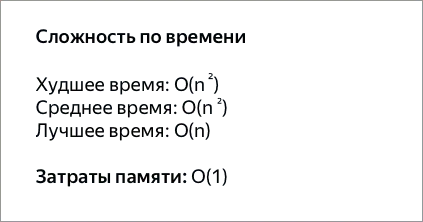
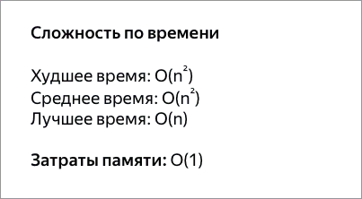
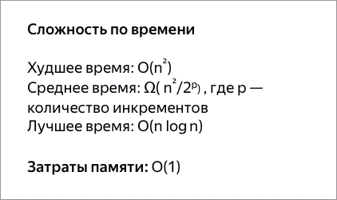
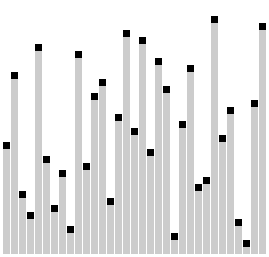
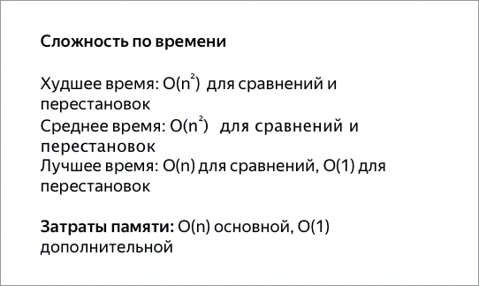

# Личная сборка описаний алгоритмов сортировки

## Алгоритмы

### Пузырьковая сортировка - Bubble Sort
Сортировка пузырьком — один из самых известных алгоритмов сортировки. 
Здесь нужно последовательно сравнивать значения соседних элементов и менять
числа местами, если предыдущее оказывается больше последующего. Таким образом
элементы с большими значениями оказываются в конце списка, а с меньшими
остаются в начале. 

### Сортировка перемешиванием (шейкерная сортировка) - Shaker Sort
Шейкерная сортировка отличается от пузырьковой тем, что она двунаправленная: 
алгоритм перемещается не строго слева направо, а сначала слева направо, затем
справа налево.

### Сортировка расчёской
Сортировка расчёской — улучшение сортировки пузырьком. Её идея состоит в
том, чтобы «устранить» элементы с небольшими значения в конце массива, которые
замедляют работу алгоритма. Если при пузырьковой и шейкерной сортировках
при переборе массива сравниваются соседние элементы, то при «расчёсывании» 
сначала берётся достаточно большое расстояние между сравниваемыми значениями,
а потом оно сужается вплоть до минимального.

Первоначальный разрыв нужно выбирать не случайным образом, а с учётом специальной
величины — фактора уменьшения, оптимальное значение которого равно 1,247.
Сначала расстояние между элементами будет равняться размеру массива, поделённому 
на 1,247; на каждом последующем шаге расстояние будет снова делиться на фактор
уменьшения — и так до окончания работы алгоритма.

### Сортировка вставками - Insertion Sort
Сортировка вставками (Insertion Sort) — это простой алгоритм сортировки. Суть его
заключается в том что, на каждом шаге алгоритма мы берем один из элементов 
массива, находим позицию для вставки и вставляем. Стоит отметить что массив 
из 1-го элемента считается отсортированным.

Основной цикл алгоритма начинается не с 0-го элемента а с 1-го, потому что 
элемент до 1-го элемента будет нашей отсортированной последовательностью (помним
что массив состоящий из одного элемента является отсортированным) и уже относительно
этого элемента с номером 0 мы будем вставлять все остальные

### Сортировка выбором - Selection Sort

### Пирамидальная сортировка - Heap Sort

### Быстрая сортировка - Quick Sort

### Сортировка слиянием - Merge Sort

## Источники

* (Книга) Грокаем Алгоритмы - Адитья Бхаргава
* (Хабр) [Основные виды сортировок и примеры их реализации](https://education.yandex.ru/journal/osnovnye-vidy-sortirovok-i-primery-ikh-realizatsii)