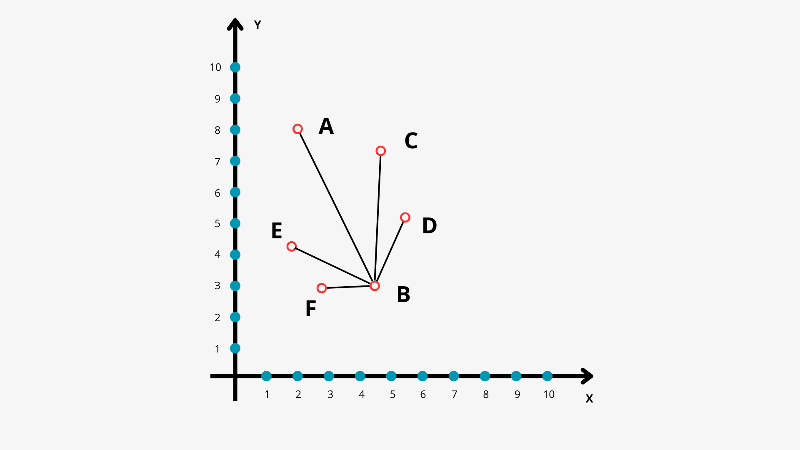

# Алгоритмы поиска

Чтобы не запутаться и не ходить по одним и тем же узлам несколько раз, мы будем
раскрашивать узлы графа следующим образом:

* **белый** — мы ещё не посещали и даже не встречали этот узел;
* **серый** — мы встречали этот узел в качестве соседа и уже добавили его 
в nodes_storage, но ещё не посещали его;
* **чёрный** — этот узел посещён и больше не нуждается в анализе.

Изначально все узлы белые. Если мы встречаем узел как соседа, мы окрашиваем его 
в серый. И только когда мы посетили узел, обработали всех его соседей, и он 
больше не нужен — красим его в чёрный цвет.

### Линейный поиск - Linear Search

Линейный поиск — это самый примитивный алгоритм поиска, который работает как с
отсортированными, так и с не отсортированными массивами.

**Сложность алгоритма:** О(n).

Алгоритм следует использовать в следующих случаях:
* Когда массив входных данных невелик.
* Если массив данных неупорядоченный. На случай если входной массив 
отсортирован, лучше будет использовать алгоритм, который мы рассмотрим далее.

### Бинарный поиск - Binary Search

Основная идея бинарного поиска заключается в делении массива по полам и отсеивании
не подходящей части. Алгоритм имеет смысл использовать только с отсортированными 
массивами.

**Сложность алгоритма в лучшем случае:** O(1).

**Сложность алгоритма в среднем:** O(logn).

Алгоритм следует использовать в следующих случаях:
* Когда входной массив отсортирован. 
* Когда нам необходимо максимально производительное решение.

### Поиск в ширину и глубину

#### Поиск в глубину - Depth-First Search

Поиск в глубину — это алгоритм обхода или поиска в таких структурах данных, как 
деревья или графы. Основан на такой структуре данных, как стек. Алгоритм начинает 
работу с корневого узла (в случае графа в качестве корневого узла выбирается 
какой-либо произвольный узел) и прежде чем вернуться назад, проходит как можно
дальше по каждой ветви.

**Сложность алгоритма:** O(V + E), где V — количество вершин, а E — количество
ребер в графе

Алгоритм следует использовать в следующих случаях:
* Когда мы знаем, что искомая вершина находится дальше всего от стартовой, или
если граф имеет большую ширину.
* Когда нам необходимо найти пути между вершинами.

#### Поиск в ширину - Breadth-First Search

Алгоритм поиска в ширину очень похож на описанный выше алгоритм поиска в 
глубину, отличается лишь тем, что в начале проходит все соседние узлы начальной 
вершины, потом все соседние узлы соседних вершин, и так далее, пока не пройдёт 
весь граф или не найдёт искомую вершину. Ещё одно отличие заключается в том, 
что основан этот алгоритм на такой структуре данных, как очередь.

**Сложность алгоритма:** O(V + E), где V — количество вершин, а E — количество
ребер в графе

Алгоритм следует использовать в следующих случаях:
* Когда мы знаем, что искомая вершина находится близко к стартовой, или если
граф имеет большую глубину.
* Когда нам необходимо найти кратчайшее расстояние в невзвешенном графе.

### Алгоритм Дейкстры - Dijkstra

Идея алгоритма Дейкстры в том, что мы можем найти наименьшие расстояния от 
начальной вершины графа ко всем остальным. Зная эти расстояния, можно построить
кратчайший маршрут между начальной и другими точками.

Алгоритм Дейкстры работает иначе: он не перебирает «в уме» все возможные 
варианты, а строит маршрут пошагово. На каждом шаге алгоритм выбирает наименее
отдалённую вершину и двигается к ней, затем к следующей — и так, пока не 
доберётся до цели.

_Ключевой смысл такой: если на каждом этапе принимать оптимальные решения, то и 
конечное решение, скорее всего, тоже окажется оптимальным. Алгоритмы которые 
работают по такому принципу, называются жадными._

Алгоритм выбирает непосещённые вершины с наименьшей оценкой и считает расстояния 
от соседних с ней вершин до **TARGET**. И продолжается это до тех пор, пока 
алгоритм не вычислит кратчайшие расстояния до **TARGET** для всех вершин.

При построении маршрутов, алгоритм имеет перечень возможных маршрутов. В процессе
поиска он обращается к оптимальному маршруту и продлевает его в сторону меньшего 
веса. В процессе работы маршруты увеличивают свой вес.

Но у алгоритма Дейкстры есть и ограничения: 
* Работает только со взвешенными графами — то есть такими, где веса между 
рёбрами известны заранее.
* Расстояния должны быть неотрицательными.

**Сложность алгоритма:** O(E * log V), где V — количество вершин, а E — количество
ребер в графе

Алгоритм следует использовать в следующих случаях:
* Когда необходимо найти кратчайший путь в взвешенном графе.
* Когда граф не имеет отрицательных весов.

### А* (А стар) - A Star

A* ищет расстояние от начальной точки до конечной. Но, в отличие от последнего,
он учитывает не только расстояние от текущей точки до начальной, но и эвристическую
оценку этого расстояния. В данном контексте «эвристическая» означает 
«примерная»: функция не определяет точное расстояние от точки до цели, но 
подсказывает алгоритму приблизительную величину.

Например, нам нужно найти кратчайший путь из города А в город В на карте. В 
качестве эвристики мы можем использовать расстояние «по прямой линии» (то есть
«евклидово расстояние») от текущей точки до точки B. Это позволит оценить длину
пути между текущей точкой и целью.

Ещё одна популярная эвристика — манхэттенское расстояние. Её название происходит
от системы улиц на острове Манхэттен в Нью-Йорке. Это сеть улиц, которые 
пересекаются под прямым углом, что делает её похожей на таблицу. Чтобы добраться
от одной точки до другой, приходится двигаться вдоль улиц. Если представить эти 
улицы в виде координатной сетки, мы можем двигаться только вдоль осей X и Y, но 
не по диагонали.

Если у нас есть две точки с координатами (x1, y1) и (x2, y2), то манхэттенское
расстояние между ними (M) вычисляется по следующей формуле:

Например, Подставляем координаты в формулу — получается, манхэттенское 
расстояние равно M = ∣4−2∣ + ∣3−8∣ = 2 + 5 = 7.

Основная идея алгоритма A* — это определение двух значений для каждой вершины в 
графе:

* g(n) — длина пути от начальной вершины до текущей вершины n.
* h(n) — эвристическая оценка длины от текущей вершины n до цели.

На каждом шаге алгоритм A* выбирает вершину с наименьшей суммой g(n) + h(n) и 
исследует её соседей. Это продолжается до тех пор, пока алгоритм не достигнет 
конечной цели.

**Сложность алгоритма:** Сложность A* зависит в первую очередь от используемой
эвристической функции.

Алгоритм следует использовать в следующих случаях:
* Есть одна четкая цель и хорошая эвристика. Это его главное преимущество. 
Например, поиск пути на карте, где в качестве эвристики используется расстояние
по прямой.
* Граф очень большой, и "слепой" поиск Дейкстры будет слишком медленным.
A* целенаправленно пойдет к цели, исследуя меньше вершин.
* Пространство поиска имеет четкую структуру (координаты, сетка), для которой 
легко задать эвристику.

## Источники

* Graph Online - инструмент для создания собсственных графов и проверки алгоритмов на них
* (Книга) Грокаем Алгоритмы - Адитья Бхаргава
* (Яндекс образование) [Обходы графа](https://education.yandex.ru/handbook/algorithms/article/obhody-grafa)
* (Хабр) [9 алгоритмов сортировки и поиска для JS, о которых вас спросят
  на собеседовании](https://habr.com/ru/companies/simbirsoft/articles/769312/)
* (Хабр) [Поиск в глубину, поиск в ширину, алгоритмы Дейкстры и А* — это один 
и тот же алгоритм](https://habr.com/ru/companies/yandex_praktikum/articles/705178/)
* (SkillBox Media) [Алгоритм Дейкстры: что это такое, как работает и где используется](https://skillbox.ru/media/code/algoritm-deykstry-chto-eto-takoe-kak-rabotaet-i-gde-ispolzuetsya/)