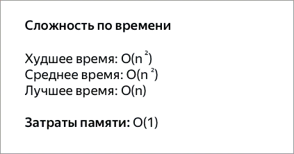
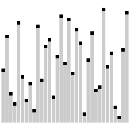
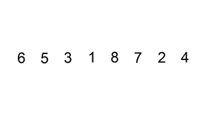
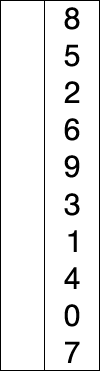

# Алгоритмы сортировки

### Пузырьковая сортировка - Bubble Sort
Сортировка пузырьком — один из самых известных алгоритмов сортировки. 
Здесь нужно последовательно сравнивать значения соседних элементов и менять
числа местами, если предыдущее оказывается больше последующего. Таким образом
элементы с большими значениями оказываются в конце списка, а с меньшими
остаются в начале. 

### Сортировка перемешиванием (шейкерная сортировка) - Shaker Sort
Шейкерная сортировка отличается от пузырьковой тем, что она двунаправленная: 
алгоритм перемещается не строго слева направо, а сначала слева направо, затем
справа налево.

### Сортировка расчёской
Сортировка расчёской — улучшение сортировки пузырьком. Её идея состоит в
том, чтобы «устранить» элементы с небольшими значения в конце массива, которые
замедляют работу алгоритма. Если при пузырьковой и шейкерной сортировках
при переборе массива сравниваются соседние элементы, то при «расчёсывании» 
сначала берётся достаточно большое расстояние между сравниваемыми значениями,
а потом оно сужается вплоть до минимального.

Первоначальный разрыв нужно выбирать не случайным образом, а с учётом специальной
величины — фактора уменьшения, оптимальное значение которого равно 1,247.
Сначала расстояние между элементами будет равняться размеру массива, поделённому 
на 1,247; на каждом последующем шаге расстояние будет снова делиться на фактор
уменьшения — и так до окончания работы алгоритма.

### Сортировка вставками - Insertion Sort
Сортировка вставками (Insertion Sort) — это простой алгоритм сортировки. Суть его
заключается в том что, на каждом шаге алгоритма мы берем один из элементов 
массива, находим позицию для вставки и вставляем. Стоит отметить что массив 
из 1-го элемента считается отсортированным.

Основной цикл алгоритма начинается не с 0-го элемента а с 1-го, потому что 
элемент до 1-го элемента будет нашей отсортированной последовательностью (помним
что массив состоящий из одного элемента является отсортированным) и уже относительно
этого элемента с номером 0 мы будем вставлять все остальные

### Сортировка выбором - Selection Sort

Сначала нужно рассмотреть подмножество массива и найти в нём максимум (или минимум).
Затем выбранное значение меняют местами со значением первого неотсортированного 
элемента. Этот шаг нужно повторять до тех пор, пока в массиве не закончатся 
неотсортированные подмассивы.

### Пирамидальная сортировка - Heap Sort
При этой сортировке сначала строится пирамида из элементов исходного массива. 
Пирамида (или двоичная куча) — это способ представления элементов, при котором
от каждого узла может отходить не больше двух ответвлений. А значение в 
родительском узле должно быть больше значений в его двух дочерних узлах.

Пирамидальная сортировка похожа на сортировку выбором, где мы сначала ищем 
максимальный элемент, а затем помещаем его в конец. Дальше нужно рекурсивно 
повторять ту же операцию для оставшихся элементов.

### Быстрая сортировка - Quick Sort

Этот алгоритм состоит из трёх шагов. Сначала из массива нужно выбрать один 
элемент — его обычно называют опорным. Затем другие элементы в массиве 
перераспределяют так, чтобы элементы меньше опорного оказались до него, а большие 
или равные — после. А дальше рекурсивно применяют первые два шага к подмассивам
справа и слева от опорного значения.

### Сортировка слиянием - Merge Sort

Сортировка слиянием пригодится для таких структур данных, в которых доступ к 
элементам осуществляется последовательно (например, для потоков). Упоминаемый
в связке с Quick Sort. Он также использует подход «разделяй и властвуй». Алгоритм
делит массив на две части, рекурсивно сортирует каждую из них, а затем объединяет
их в один отсортированный массив.

## Источники

* (Яндекс образование) [Основные виды сортировок и примеры их реализации](https://education.yandex.ru/journal/osnovnye-vidy-sortirovok-i-primery-ikh-realizatsii)
* (Книга) Грокаем Алгоритмы - Адитья Бхаргава
* (Хабр) [Это база. Алгоритмы сортировки для начинающих](https://habr.com/ru/companies/selectel/articles/851206/#5)
* (Статья) [Пирамидальная сортировка](https://prog-cpp.ru/sort-pyramid/)